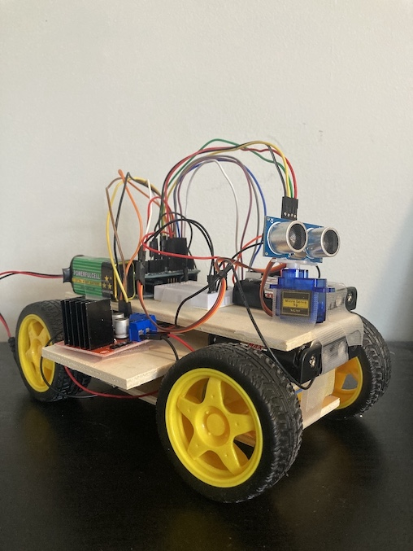

## Obstacle Avoiding Vehicle
Simple obstacle avoiding vehicle using Arduino.  
#####Components: 
- Arduino Uno x 1
- Arduino Prototype Expansion Board x 1
- HC-SR04 Ultrasonic sensor x 1
- TT DC Gearbox Motor x 4
- L298N Dual H Bridge Motor Driver Controller Board x 2
- SG90 Micro Servo Motor x 1
- Mini breadboard x 1
- Battery holder for 4 AA batteries x 2
- Battery holder for 3 AA batteries x 1
- 9V battery x 1

When the ultrasonic sensor sends a ping and detects an object <25 cm in front of the vehicle, the micro servo will rotate
the ultrasonic sensor 90 degrees to the left and 90 degrees to the right. The direction which returns a 
ping with the largest distance value is the direction the vehicle will travel in.

## Images

 
### Inspiration 
https://create.arduino.cc/projecthub/adam/obstacle-avoiding-car-a192d9  
